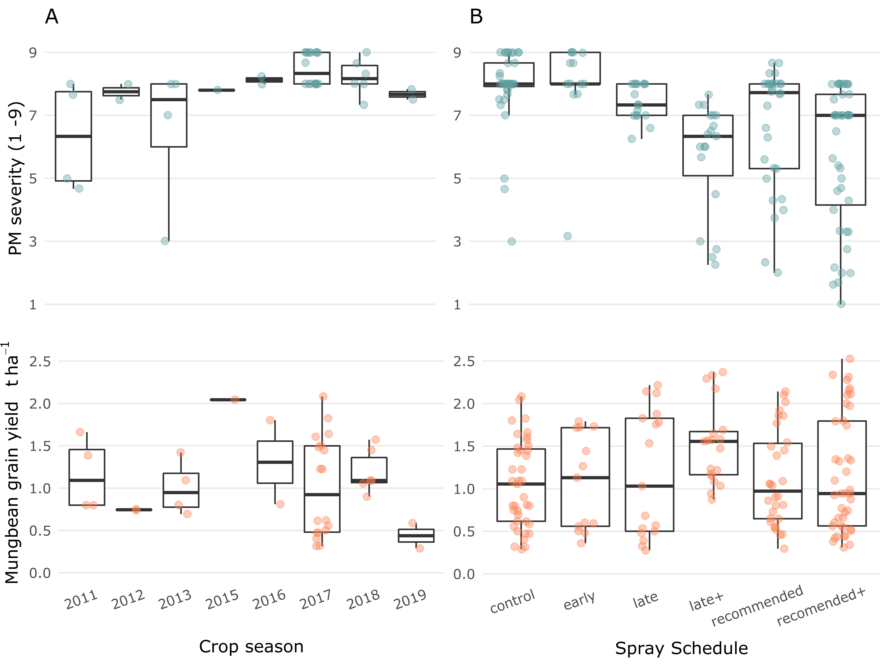

# Preliminary Analysis

```{r PA_Libraries, echo=TRUE, results='hide'}
if (!require("pacman"))
   install.packages("pacman")
pacman::p_load(tidyverse,
               lubridate,
               bomrang,
               openxlsx,
               devtools,
               reshape2,
               lme4,
               kableExtra,
               flextable,
               here,
               gridExtra)

if (!require("theme.usq"))
   remotes::install_github("adamhsparks/theme.usq")
library(theme.usq)
theme_set(theme_usq()
)
load("cache/ImportDataAndSelectTrials01.Rdata")
```

<br>  
<br>  

## Trial summary statistics  

The data explored in the `PM_MB_dat` data frame is a clean data frame focusing on trials which met the selection criteria testing DMI fungicides (tebuconazole / propiconazole) or no spray controls. 

<br>  

### Trial seasons
How many trials were undertaken each season.  

```{r FinalTrialsForInclusion1}
PM_MB_dat %>%
   distinct(trial_ref, location, year) %>%
   arrange(year) %>%
   group_by(year) %>%
   summarise(n = n())%>%
   flextable()
   
```

<br>  
<br>  

### Trial locations
The location of the trials including DMI fungicides.  

```{r FinalTrialsForInclusion}
PM_MB_dat %>%
   distinct(trial_ref, location, year) %>%
   group_by(location) %>%
   summarise(n = n())%>%
   flextable()
```

<br>  
<br>  

### Powdery mildew severity and mungbean grain yield summary per trial  
Show a summary of both `powdery mildew severity` and mungbean `grain yield` means and ranges for all trials including DMI fungicides.  

```{r Full_Trial_Summary_table, warning= FALSE}
Sev_yield_table <-
   PM_MB_dat %>%
   mutate(PM_sev_control = case_when(fungicide_ai == "control" ~ PM_final_severity,
                                     TRUE ~ NA_real_)) %>%
   mutate(PM_sev_treat = case_when(fungicide_ai != "control" ~ PM_final_severity,
                                   TRUE ~ NA_real_)) %>%
   mutate(PM_y_control = case_when(fungicide_ai == "control" ~ grain_yield.t.ha.,
                                   TRUE ~ NA_real_)) %>%
   mutate(PM_y_treat = case_when(fungicide_ai != "control" ~ grain_yield.t.ha.,
                                 TRUE ~ NA_real_)) %>%
   mutate(trial_ref = str_remove(trial_ref, "mung")) %>%  # remove "mung" prefix from trial_ref
   group_by(trial_ref,
            location,
            year,
            planting_date,
            first_sign_disease) %>%
   summarise(
      n = n(),
      m_PM_sev_control = round(median(PM_sev_control, na.rm = TRUE), digits = 2),
      n_controls = sum(is.na(PM_sev_control) == FALSE),
      min_PM_sev = round(min(PM_sev_treat, na.rm = TRUE), digits = 2),
      max_PM_sev = round(max(PM_sev_treat, na.rm = TRUE), digits = 2),
      m_PM_yield_control = round(mean(PM_y_control, na.rm = TRUE), digits = 3),
      min_PM_yield = round(min(PM_y_treat, na.rm = TRUE), digits = 3),
      max_PM_yield = round(max(PM_y_treat, na.rm = TRUE), digits = 3),
      .groups = "drop"
   ) %>%
   arrange(year) %>%
   mutate(PM_sev_range = paste(min_PM_sev, max_PM_sev, sep = " - ")) %>%
   mutate(yield_range = paste(min_PM_yield, max_PM_yield, sep = " - ")) %>%
   mutate(m_PM_sev_control = paste(m_PM_sev_control, " (", n_controls, ")", sep = "")) %>%
   select(-c(min_PM_sev, max_PM_sev, min_PM_yield, max_PM_yield, n_controls)) %>%
   select(c(1:7, 9, 8, 10)) %>% # order columns
   flextable() %>%
   set_header_labels(
      trial_ref = "Trial code",
      location = "Location",
      year = "Year",
      planting_date = "Sowing date",
      first_sign_disease = "PM onset",
      n = "n",
      m_PM_sev_control = "Control median\nPM severity",
      PM_sev_range = "PM severity\nrange",
      m_PM_yield_control = "Control\nmean yield",
      yield_range = "Yield range\n(t / ha)"
   ) %>%
   fontsize(size = 8, part = "body") %>%
   fontsize(size = 10, part = "header") %>%
   align(j = 3:10, align = "center", part = "all") %>%
   autofit() %>%
   width(j = 7:10, width = 1) %>%
   width(j = 3, width = 0.5) %>%
   set_caption(
      "Table 1: Mean yield and severity for trials included in the meta-analysis. Powdery mildew (PM) onset date, number of treatments per trial (n), PM median plot severity of the non-fungicide treated plots and the severity range in fungicide treatments, bracketed numbers refer to the number of pooled control treatments summarised; Mean yield in non-fungicide treated control and the range of yields in the fungicide treatments in tonnes per hectare"
   )
Sev_yield_table
```

```{r eval=FALSE, include=FALSE}
# Save table as a word document
doc <- officer::read_docx()
doc <- body_add_flextable(doc, value = Sev_yield_table)
doc <- officer::body_end_section_landscape(doc)
print(doc, target = "paper/figures/Table1_severity&yield.docx")
```
<br>  
<br>  


### Summary plots
#### Seasonal disease pressure in the control  

```{r bwplot_sev}
sev_control_plot <- 
   PM_MB_dat %>%
   filter(fungicide_ai == "control") %>%
   ggplot(aes(x = year, y = PM_final_severity)) +
   geom_boxplot(outlier.alpha = 0) +
   geom_jitter(size = 2, colour = "cadetblue",alpha = 0.4,width = 0.15) +
   scale_y_continuous(breaks = c(1,3,5,7,9), limits = c(0.9,9.1)) +
   ylab("PM severity (1 -9)")+
   # xlab("Crop season")+
   # theme(axis.title.x=element_blank(),
   #      axis.text.x=element_blank(),
   #      axis.ticks.x=element_blank())+
   ggtitle("A")

sev_control_plot      
```
<br>  
<br>  

#### Disease severity range for each spray schedule  

```{r bwplot_yield}
sev_schedule_plot <-
   PM_MB_dat %>%
   ggplot(aes(x = spray_management, y = PM_final_severity)) +
   geom_boxplot(outlier.alpha = 0) +
   geom_jitter(
      size = 2,
      colour = "cadetblue",
      alpha = 0.4,
      width = 0.15
   ) +
   scale_y_continuous(breaks = c(1, 3, 5, 7, 9), limits = c(0.9, 9.1)) +
   scale_x_discrete(labels = c(
      "control",
      "early",
      "late",
      "late+",
      "recommended",
      "recomended+"
   )) +
   ylab("PM severity (1 -9)") +
   # xlab("Spray Schedule")+
   ggtitle("B")
   
sev_schedule_plot
```

<br>  
<br>  

#### Seasonal grain yield in the control  

```{r bwplot_yield_year}
Y_control_plot <-
   PM_MB_dat %>%
   filter(fungicide_ai == "control") %>%
   ggplot(aes(x = year, y = grain_yield.t.ha.)) +
   geom_boxplot() +
   geom_jitter(
      size = 2,
      colour = "coral",
      alpha = 0.4,
      width = 0.15
   ) +
   scale_y_continuous(breaks = seq(0, 2.5, by = 0.5), limits = c(0, 2.6)) +
   ylab(bquote('Mungbean grain yield ' *  ~  ~ t ~ ha ^ -1 * "")) +
   xlab("Crop season") +
   theme(axis.text.x = element_text(angle = 20, hjust = 0.75),
         plot.margin = margin(0.2, 0, 0.71, 0, "cm"),
         axis.title.x = element_text(vjust = -5))

Y_control_plot
```

<br>  
<br>  

#### Mungbean yield for each spray schedule   

```{r bwplot_yield_sched}
Y_schedule_plot <- 
   PM_MB_dat %>%
   ggplot(aes(x = spray_management, y = grain_yield.t.ha.)) +
   geom_boxplot(outlier.alpha = 0) +
   geom_jitter(
      size = 2,
      colour = "coral",
      alpha = 0.4,
      width = 0.15
   ) +
   scale_y_continuous(breaks = seq(0, 2.5, by = 0.5), limits = c(0, 2.6)) +
   scale_x_discrete(labels = c(
      "control",
      "early",
      "late",
      "late+",
      "recommended",
      "recomended+"
   )) +
   #ylab(bquote('Mungbean grain yield ' *  ~  ~ t ~ ha ^ -1 * "")) +
   xlab("Spray Schedule")+
    theme(
      axis.title.y = element_blank(),
      axis.text.x = element_text(angle = 20, hjust = 0.75))

Y_schedule_plot
```

```{r include = FALSE}
#library(gridExtra)
# save plots into a 4 x 4 grid for publication

p4 <- arrangeGrob(
   sev_control_plot + theme(
      axis.title.x = element_blank(),
      axis.text.x = element_blank(),
      axis.title.y = element_blank()
   ),
   sev_schedule_plot + theme(
      axis.title.x = element_blank(),
      axis.text.x = element_blank(),
      axis.title.y = element_blank()
   ),
   Y_control_plot,
   Y_schedule_plot
)

ggsave(
   filename = "paper/figures/Fig1_boxplots_yield&sev.tiff",
   plot = p4,
   device = "tiff",
   height = 6,
   width = 7,
   dpi = 300,
   units = "in"
      
)
```
 
 
  

<br>  
<br>  
<br>  
<br>  

*****  

## Treatment focused summaries

Various factors have been studied in the collated trials which may influence the subsequent meta-analysis.
A quick inspection of the following factors were done to examine the possible influence these variables may have on on mungbean grain yield and/or powdery mildew mean plot severity.

   1. [Fungicide type] (propiconazole and tebuconazole)  
   2. [Fungicide Doses]
   3. [Number of fungicide sprays]  
   4. [Host cultivar][Mungbean cultivars] (probably is a co-variate with season due to changing cultivars over time)  
   5. [Row spacing]  
   6. [Final disease rating / disease pressure][Disease pressure]
   7. [Moisture availability for the crop][In-crop rainfall]
   
The data plotted below are from `r length(unique(PM_MB_dat$trial_ref))` field trials between (`r min(PM_MB_dat$year)` - `r max(PM_MB_dat$year)`) of which the details are described in the [Trials considered for inclusion in meta-analysis].  

<br>  

### Fungicide type
#### Powdery mildew severity
```{r TebuVPropi_sev}
n_C <- sum(PM_MB_dat$fungicide_ai == "control")
n_P <- sum(PM_MB_dat$fungicide_ai == "propiconazole")
n_T <- sum(PM_MB_dat$fungicide_ai == "tebuconazole")

PM_MB_dat %>%
   ggplot(aes(y = PM_final_severity, x = as.factor(fungicide_ai))) +
   xlab("Fungicide treatment") +
   ggtitle(label = "Powdery mildew severity for each fungicide active ingredient") +
   labs(caption = paste("Control n:", n_C,
                        "; Propiconazole n:", n_P,
                        "; Tebuconazole n:", n_T, sep = "")) +
   geom_boxplot() +
   scale_fill_usq() +
   scale_colour_usq()
```

<br>  
<br>  


#### Yield effect
```{r TebuVPropi_Yi}
PM_MB_dat %>%
   ggplot(aes(y = grain_yield.t.ha., x = as.factor(fungicide_ai))) +
   xlab("Fungicide treatment") +
   ggtitle(label = "Grain yield for each fungicide active ingredient") +
   labs(caption = paste("Control n:", n_C,
                        "; Propiconazole n:", n_P,
                        "; Tebuconazole n:", n_T, sep = "")) +
   geom_boxplot() +
   scale_colour_usq()
```

<br>  
<br>  
<br>  

### Fungicide Doses{#fungicide-doses}  
This analysis focuses only the DMI fungicides, tebuconazole and propiconazole, which were trialled the most often.

We should check that all fungicide doses that were used were roughly the same, if we are to compare between trials where dose might be different.

```{r tebuAndPropi_dose}
PM_MB_dat %>%
   filter(fungicide_ai == "tebuconazole" |
             fungicide_ai == "propiconazole") %>%
   ggplot(aes(x = as.factor(dose_ai.ha), fill = fungicide_ai)) +
   xlab("Dose (g ai/ha)") +
   ggtitle(label = "Total number of treatments for each respective tebuconazole\nor propiconazole dose") +
   geom_bar() +
   scale_fill_usq() +
   scale_colour_usq()
```

All trials that used tebuconazole used approximately the same dose.
Dose of the active ingredient ranged from 62.35&nbsp;g per hectare to 60&nbsp;g per hectare.

Doses for propiconazole range from 62.5&nbsp;g to 125&nbsp;g, a large variation.  
Let's inspect the difference in yields for each dose.

```{r PropiDoseEffect}
PM_MB_dat %>%
   filter(fungicide_ai == "propiconazole") %>%
   ggplot(aes(x = relevel(as.factor(dose_ai.ha), "62.5"), y = grain_yield.t.ha.)) +
   xlab("Dose (g ai/ha)") +
   labs(label = "Yield for each respective propiconazole dose",
        caption = "Facets indicate the number of applications") +
   geom_boxplot(fill = usq_cols("usq charcoal"), alpha = 0.5) +
   ylab("Grain yield t / ha") +
   facet_grid(cols = vars(total_fungicide))
```

This dose effect should be investigated in the meta-analysis.  

<br>  
<br>  

How many treatments of each dose have been investigated per trial?  

```{r table_PropiDoses}
table(as.character(PM_MB_dat[PM_MB_dat$fungicide_ai == "propiconazole",]$trial_ref),
      PM_MB_dat[PM_MB_dat$fungicide_ai == "propiconazole",]$dose_ai.ha)
```
<br>  
<br>  


### Number of fungicide sprays  

Inspect the frequency of sprays per fungicide.  
```{r Fungicide_x_nSprays}
table(PM_MB_dat$fungicide_ai, PM_MB_dat$total_fungicide)
```
Very few treatments were sprayed more than three times and only in `r unique(PM_MB_dat[PM_MB_dat$total_fungicide == 3,"trial_ref"])`

<br>  
<br>  


### Mungbean cultivars

Australian mungbean varieties have the following resistance to powdery mildew.

   - Berken: Highly susceptible
   
   - Crystal: Susceptible
   
   - Jade: Moderately susceptible

Let's view a stacked bar plot of the number of sprays for both demethylation inhibitors, tebuconazole and propiconazole against each cultivar.

```{r Host_genotype, message=FALSE}
PM_MB_dat %>%
   filter(fungicide_ai == "tebuconazole" |
             fungicide_ai == "propiconazole") %>%
   group_by(host_genotype, fungicide_ai, trial_ref) %>%
   summarise() %>%
   count() %>%
   rename(Treatments = n) %>%
   ggplot(aes(x = host_genotype, y = Treatments, fill = fungicide_ai)) +
   xlab("Cultivar") +
   ylab("N Trials") +
   ggtitle(label = "Cultivars used in either tebuconazole or propiconazole trials") +
   geom_col() +
   scale_fill_usq(name = "Fungicide AI")
```


#### Yield loss in cultivar Jade  

Cultivar Jade shows the best quantitative resistance to powdery mildew.  
Based on the 2016 GRDC report by Sue Thompson [-@SueThompson2016] we want to know what is the possible yield loss for this moderately susceptible cultivar.

```{r JadeYieldLoss}
PM_MB_dat %>%
   filter(year == "2016",
          host_genotype == "Jade") %>%
   mutate(Treatment = case_when(fungicide_ai == "control" ~ "control_yield",
                                TRUE ~ "FungicideTreated_yield")) %>%
   group_by(location, Treatment) %>%
   summarise(
      trial_ref = trial_ref,
      location = location,
      year = year,
      Yield = mean(grain_yield.t.ha., na.rm = TRUE),
      .groups = "drop"
   ) %>%
   distinct() %>%
   pivot_wider(names_from = Treatment, values_from = Yield) %>%
   mutate(Diff = FungicideTreated_yield - control_yield) %>%
   mutate(percent = (Diff / FungicideTreated_yield) * 100) %>%
   select(trial_ref,
          location,
          year,
          control_yield,
          FungicideTreated_yield,
          percent,
          Diff) %>%
   flextable()
```

<br>  
<br>  


### Row spacing  

Some experiments were designed to investigate the effect of row spacing and plant density on powdery mildew disease as well as fungicide timing and efficacy.
The results showed that the row spacing had no statistically significant effect on powdery mildew, but narrower rows in most cases increased yield significantly.
This finding has also been shown by several other researchers' work in Queensland and New South Wales as well.


```{r row_spacing.m}
PM_MB_dat %>%
   filter(fungicide_ai == "tebuconazole" |
             fungicide_ai == "propiconazole") %>%
   group_by(fungicide_ai, row_spacing, trial_ref) %>%
   summarise() %>%
   count() %>%
   rename(Trials = n) %>%
   ggplot(aes(x = as.factor(row_spacing), y = Trials)) +
   xlab("Row Spacing (m)") +
   ylab("N Trials") +
   ggtitle(label = "Trial row spacing using tebuconazole") +
   geom_col(aes(fill = fungicide_ai),
            position = "dodge") +
   scale_fill_usq(name = "Fungicide AI")
```

<br>  
<br>  

Will plotting row spacing treatments show differences for the response variables, *yield* and *disease severity*.  
The main questions are:  

   * Were there any statistical differences for mungbean *yield* or *powdery mildew severity* between row spacing treatments?  
   
   * If not, can we pool certain row spacing that have no significant difference?  


```{r RS_severity}
# Which row spacing leads to the higher disease severity
PM_MB_dat %>%
   filter(year == 2017 |
             year == 2018) %>%
   filter(fungicide_ai == "control") %>%
   ggplot(aes(y = PM_final_severity, x = factor(row_spacing))) +
   geom_boxplot(fill = usq_cols("usq charcoal"), alpha = 0.5) +
   ylab("Final severity rating") +
   xlab("Row spacing (m)") +
   ggtitle("Powdery mildew severity between different row spacing across all trials")
```

There is little difference here between the row spacing treatments, Let's look if there is a trial location effect as disease pressure lead to varying results.  

```{r RS_severity_x_trial}
# Does trial year and location interact between row spacing amd disease severity
PM_MB_dat %>%
   filter(year == 2017 |
             year == 2018) %>%
   filter(fungicide_ai == "control") %>%
   ggplot(aes(y = PM_final_severity, x = factor(row_spacing))) +
   geom_boxplot(fill = usq_cols("usq charcoal"), alpha = 0.5) +
   facet_grid(cols = vars(location)) +
   ggtitle("Powdery mildew variation between different row spacing") +
   ylab("Final severity rating") +
   xlab("Row spacing (m)")
```

<br>  

In the Wellcamp site, wider row spacing reduces PM severity, the other sites it seems there was not enough variation to make a distinction between row spacing treatments.

```{r RS_yield}
# Which row spacing leads to the higher yield potential
PM_MB_dat %>%
   filter(year == 2017 |
             year == 2018) %>%
   ggplot(aes(
      y = as.numeric(grain_yield.t.ha.),
      x = as.factor(row_spacing),
      colour = location
   )) +
   geom_jitter(width = 0.05) +
   ggtitle("Grain yield results for different row spacing at three locations") +
   xlab("Row spacing (m)") +
   ylab("Grain yield (t/ha)") +
   scale_colour_usq()
```

The plots seem to imply when yield is limited, presumably by other abiotic factors, there is no effect of row spacing on yield, like in the Hermitage trial.
However, if the average yield is more than approximately 1 t/ha then smaller row spacing has the potential to provide greater yield per hectare.

Overall row spacing may influence both powdery mildew severity and yield.
However, in the trial reports, no significant interaction was found between row spacing, powdery mildew severity and yield.
That is, with narrower row spacing appeared to increase yield even if the amount of powdery mildew increased and no relationship could be detected between an interaction of the three.

<br>  
<br>  


### Disease pressure  
The amount of disease pressure between seasons is another variable which could impact mungbean yield meta-analysis effect size. 
```{r D_pres}
# Assess the effect of yield pressure on the spray schedule efficacy
# Use quantiles to separate disease pressure into High, Medium and low disease pressure categories
DP33 <- 
   PM_MB_dat %>%
   filter(fungicide_ai == "control") %>%
   pull(PM_final_severity) %>%
   quantile(0.3333)

DP66 <- 
   PM_MB_dat %>%
   filter(fungicide_ai == "control") %>%
   pull(PM_final_severity) %>%
   quantile(0.6666)


   

PM_MB_dat %>%
   mutate(yc = case_when(fungicide_ai == "control" ~ grain_yield.t.ha.,
                         TRUE ~ NA_real_))%>%
   group_by(trial_ref)%>%
   mutate(yc = mean(yc, na.rm=TRUE)) %>%
   mutate(yield_saved = case_when(fungicide_ai != "control" ~ grain_yield.t.ha. - yc,
                    fungicide_ai == "control" ~ NA_real_)) %>%
   mutate(dc = case_when(fungicide_ai == "control" ~ PM_final_severity,
                         TRUE ~ NA_real_))%>%
   mutate(dc = mean(dc, na.rm = TRUE))%>%
   ungroup() %>%
   mutate(disease_pressure = case_when(dc <= DP33 ~ "low",
                                 dc <= DP66 &
                                 dc > DP33 ~ "medium",
                                 dc > DP66 ~ "high",
                                 TRUE ~ NA_character_))%>%
   filter(spray_management != "control") %>%
   ggplot(aes(disease_pressure, yield_saved))+
   geom_boxplot()+ 
   facet_grid(. ~ spray_management)
   
```

From these plots it is difficult to determine if there is an interaction between disease pressure and the yield saved, or if no interaction exists and fungicide efficacy in general has greater potential to save yield when disease pressure is higher.
It is worth noting there was not sufficient variation in the control plot disease severity to produce a `medium` disease severity category.


<br>  
<br> 
<br>  
<br>  


### In-crop rainfall  
#### Whole season

First an inspection of all rainfall within the season
```{r season_rainfall}
source("R/add_lat_longs.R") # code adds the latitude- and longitude to PM_MB_dat
source("R/crop_rain.R")

# Obtain rainfall from bomrang

crop_rain(location_name = PM_MB_dat$location,
          latitude = PM_MB_dat$lat,
          longitude = PM_MB_dat$lon,
          first_day = PM_MB_dat$planting_date,
          last_day = PM_MB_dat$harvest_date)


PM_MB_dat$sum_rain <-
   crop_rain(location_name = PM_MB_dat$location,
          latitude = PM_MB_dat$lat,
          longitude = PM_MB_dat$lon,
          first_day = PM_MB_dat$planting_date,
          last_day = PM_MB_dat$harvest_date)

# plot yield vs rainfall
PM_MB_dat %>%
   ggplot(aes(y = grain_yield.t.ha., x = sum_rain)) + 
   geom_point()
```

```{r lm_total}
summary(lm(grain_yield.t.ha. ~ sum_rain, data = PM_MB_dat))
```

<br>  
<br>  

#### Early-season rainfall
Here we only look at the effect of rainfall between the _planting date_ and _first sign of disease_. 
We are choosing first sign of disease as a mid point in the crop maturity.  

```{r early_season_rain}
PM_MB_dat$early_rain <-
   crop_rain(location_name = PM_MB_dat$location,
          latitude = PM_MB_dat$lat,
          longitude = PM_MB_dat$lon,
          first_day = PM_MB_dat$planting_date,
          last_day = PM_MB_dat$first_sign_disease)

PM_MB_dat %>%
   ggplot(aes(y = grain_yield.t.ha., x = early_rain)) + 
   geom_point()
```

```{r lm_early_rain}
summary(lm(grain_yield.t.ha. ~ early_rain, data = PM_MB_dat))
```

There is a significant negative association here, indicating rain fall early in the crop development negativley affects mungbean yields. However the very low R-squared value indicates it is no a strong one.

<br>  
<br>  

#### Late-season rainfall  
Here we only look at the effect of rainfall between the _first sign of disease_ and _crop harvest_.

```{r late_rain}
PM_MB_dat$late_rain <-
   crop_rain(location_name = PM_MB_dat$location,
          latitude = PM_MB_dat$lat,
          longitude = PM_MB_dat$lon,
          first_day = PM_MB_dat$first_sign_disease,
          last_day = PM_MB_dat$harvest_date)


PM_MB_dat %>%
   ggplot(aes(y = grain_yield.t.ha., x = late_rain)) + 
   geom_point()
```

```{r lm_late_rain}
summary(lm(grain_yield.t.ha. ~ late_rain, data = PM_MB_dat))
```

There is a significant positive association here, indicating rainfall after disease commences is likely to lead to increased yield. However the very low R-squared value indicates it is no a strong one.

<br>  
<br>  

#### Mid-season rainfall  
Here we only look at the effect of rainfall between the 20 days after planting and 80 days after planting.
```{r mid_rain}
PM_MB_dat$mid_rain <-
   crop_rain(location_name = PM_MB_dat$location,
          latitude = PM_MB_dat$lat,
          longitude = PM_MB_dat$lon,
          first_day = ymd(PM_MB_dat$planting_date) + days(20),
          last_day = ymd(PM_MB_dat$planting_date) + days(80)
   )

PM_MB_dat %>%
   ggplot(aes(y = grain_yield.t.ha., x = mid_rain)) + 
   geom_point()
```

```{r lm_mid_rain}
summary(lm(grain_yield.t.ha. ~ mid_rain, data = PM_MB_dat))
```
There is no association with mid season rain and crop yields.  

<br>  
<br> 
<br> 
******  

### FAO mungbean data

An important consideration for why to carry out work on mungbean diseases is the value the crop provides. 
Let's pull in data from the FAOSTAT website for the area of mungbean crops harvested.

```{r FAO_data_inquiry}
beans <- read.csv(here("data/FAOSTAT_data_7-6-2020.csv"))

str(beans)

beans %>%
   filter(Item == "Beans, dry",
          Element == "Area harvested") %>%
   select(Year, Value) %>%
   ggplot(aes(y = Value, x = Year)) +
   geom_point() +
   geom_smooth()
```

