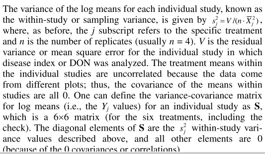

# Meta-analysis

## Data-wrangling

```{r Meta_dataImport}
PM_MB_means <- read.csv("data/1902 powdery mildew-Mungbean - Collated means.csv", stringsAsFactors = FALSE)

#str(PM_MB_means)
```


When investigating previous studies into Powdery Mildew Fungicide efficacy on Mungbean `r length(unique(PM_MB_means$Trial_ref))` trials were found, however only eleven Tebeconazol were used for the following meta-analysis, followed by the next common Fungicide Propiconazole. Sulphur was disregarded due to it's inconsistancy in efficacy.

```{r Fungicides}
unique(PM_MB_means$Fungicide)
PM_MB_means %>%
   group_by(Fungicide,Trial_ref) %>%
   summarise() %>%
   count(sort = T) %>%
   rename(Trials = n) %>%
   kable()

```

### Fungicide Doses
All trials that used Tebeconazole used approimately the same dose. dose of the active ingredient ranged from 62.35 grams per hectare to 60 grams per hectare. 
```{r Tebe_dose}
PM_MB_means %>%
   filter(Fungicide == "Tebeconazole") %>%
   select(Trial_ref, Year, Location, first_sign_disease, Dose.ai.ha., total_Fungicide) %>%
   kable()
```

### Row spacing

Some experiments were designed to investigate the effect of row spacing and plant density on Powdery Mildew disease and crop yield. The results showed that shorter distances between rows increase crop yields and mitigated the yield impact of the disease.  
Seven trials used a row spacing of 0.75 meters.

```{r row_spacing}
PM_MB_means %>%
   filter(Fungicide == "Tebeconazole") %>%
   group_by(row_spacing,Trial_ref) %>%
   summarise() %>%
   count() %>%
   rename(Treatments = n) %>%
   kable()


PM_MB_means %>%
   filter(Fungicide == "Tebeconazole",
          row_spacing == 0.75) 

```

### Host genotypes
Host genotype may have to be analysed to determine the effect.  
```{r Host_genotype}
PM_MB_means %>%
   filter(Fungicide == "Tebeconazole",
          row_spacing == 0.75) %>% 
   group_by(host_genotype, Trial_ref) %>%
   summarise() %>%
   count() %>%
   rename(Treatments = n) %>%
   kable()


PM_MB_means %>%
   filter(Fungicide == "Tebeconazole") %>%
   group_by(row_spacing,Trial_ref) %>%
   summarise() %>%
   count() %>%
   rename(Treatments = n) %>%
   kable()
   
```
In general the mungbean varieties have the following resistance to powdery mildew.  
   - Berken: Highly susceptible  
   - Crystal: Susceptible  
   - Jade: Moderatly susceptible  
   


### standardising the type of variance  

The type of variance needs to be standardised between trials and treatments for the meta-analysis. 

```{r variance}
PM_MB_means %>%
   filter(Fungicide == "Tebeconazole",
          row_spacing == 0.75) %>%
   group_by(Y_error.type) %>%
   summarise(n = length(Y_error.type))

   
```


```{r LSD_trials}
Trials <- PM_MB_means %>%
   filter(Fungicide == "Tebeconazole",
          row_spacing == 0.75,
          Y_error.type == "lsd (P=0.05)")%>%
   select(Trial_ref)%>%
   distinct()

```


The trial, `mung1112/02` uses Least squre differences to describe the variation within the experiment. The following code attempts to convert this to sampling variance as per the method in [Nugugi et.al (2011)](https://apsjournals.apsnet.org/doi/10.1094/PHYTO-08-10-0221). Ideas for using a T-critical value of 1.697 came from reading a [statisics-how-to website](https://www.statisticshowto.datasciencecentral.com/how-to-calculate-the-least-significant-difference-lsd/). A [table of T-critical values](https://www.statisticshowto.datasciencecentral.com/tables/t-distribution-table/) was consulted where 30 degrees of freedom within expeiment was used to find the 'T-crit' value of 1.697.




```{r LSD_2_Sampling Variance}
# Formula and modifications based off information found at https://www.statisticshowto.datasciencecentral.com/how-to-calculate-the-least-significant-difference-lsd/

for(Trial2012 in Trials$Trial_ref){


Tcrit <- 1.697  # 0.05 and DFw = 30 # T critical value for which there is significant difference between two groups; This value is the same for both trials "mung1112/01" and "mung1112/02"
DFw <- sum(PM_MB_means[PM_MB_means$Trial_ref == Trial2012,]$Replicates) - 
   length(PM_MB_means[PM_MB_means$Trial_ref == Trial2012,]$Replicates) # degrees of freedom within groups
# n.A <- PM_MB_means[PM_MB_means$Trial_ref == "Trial2012,]$Replicates[1]
# n.B <- PM_MB_means[PM_MB_means$Trial_ref == "Trial2012,]$Replicates[2]
LSD <- PM_MB_means[PM_MB_means$Trial_ref == Trial2012,]$Yield_error[1]


# SSwithin <- #unknown
# MSW <- SSwithin / DFw # mean square within (SS within / DF within)


#  LSD = (Tcrit) * sqrt(MSW * (1/n.A + 1/n.B))
#  (LSD/Tcrit) = sqrt(MSW * (1/n.A + 1/n.B))
#  (LSD/Tcrit)^2 = MSW * (1/n.A + 1/n.B)
#  (LSD/Tcrit)^2/(1/n.A + 1/n.B) = MSW
#  MSE <- (LSD/Tcrit)^2/(1/n.A + 1/n.B) # This formula was abandon in favor for the formula in Nugugi et. at (2011)
MSE <- PM_MB_means[PM_MB_means$Trial_ref == Trial2012,]$Replicates[1]*(LSD/Tcrit)^2/2 # method for finding variance in Nugugi et.al (2011) DOI: 10.1094/phyto-08-10-0221


for(j in seq_along(PM_MB_means[PM_MB_means$Trial_ref == Trial2012,]$Replicates)){
   if(j == 1){Sv <- vector(length = length(PM_MB_means[PM_MB_means$Trial_ref == Trial2012,]$Replicates))}
#  Sv[j]^2 = MSE/(PM_MB_means[PM_MB_means$Trial_ref == Trial2012,]$Replicates[j] *
#                   PM_MB_means[PM_MB_means$Trial_ref == Trial2012,]$grain_yield.t.ha.[j])
# Balance equation 
   Sv[j] = sqrt(MSE/(PM_MB_means[PM_MB_means$Trial_ref == Trial2012,]$Replicates[j] *
                  as.numeric(PM_MB_means[PM_MB_means$Trial_ref == Trial2012,]$grain_yield.t.ha.[j])))

   }

# and replacing the values in the dataset

PM_MB_means[PM_MB_means$Trial_ref == Trial2012,]$Yield_error <- Sv
PM_MB_means[PM_MB_means$Trial_ref == Trial2012,]$Y_error.type <- "SamplingVariance"

}
```


Now to estimate the variance from the standard deviation

```{r stdev2SampVariance}
# subset data by those which describe the Yield error with standard deviation
Trials <- PM_MB_means %>%
   filter(Fungicide == "Tebeconazole",
          row_spacing == 0.75,
          Y_error.type == "stdev")%>%
   select(Trial_ref)%>%
   distinct()


# calculate the Sampling variance from the standard deviation
# standard error of the mean equals the standard deviation divided by the square root of the number of samples
# Sv <- sem^2 <- stdev/sqrt(n)
# Sampling variance eqauls the square of the standard error.
# Sv <- (stdev/sqrt(n))^2

# Therefore 

for(j in seq_along(PM_MB_means[PM_MB_means$Trial_ref %in% Trials$Trial_ref,]$Yield_error)){
# create empty vector at first iteration with length of j
   if(j == 1){Sv <- vector(length = length(PM_MB_means[PM_MB_means$Trial_ref %in% Trials$Trial_ref,]$Yield_error))}

# Equation to convert standard deviation to Sampling Variance 
   Sv[j] = (PM_MB_means[PM_MB_means$Trial_ref %in% Trials$Trial_ref,]$Yield_error[j]/
               sqrt(PM_MB_means[PM_MB_means$Trial_ref %in% Trials$Trial_ref,]$Replicates[j]))^2
   }


   # and replacing the values in the dataset
PM_MB_means[PM_MB_means$Trial_ref %in% Trials$Trial_ref,]$Yield_error <- Sv
PM_MB_means[PM_MB_means$Trial_ref %in% Trials$Trial_ref,]$Y_error.type <- "SamplingVariance"

```


Now for the trickier part creating 'Sampling Variance' for treatments where only mean yeild is recorded.  
The trial which does not report any type of variance also reports that there is no significant difference between the means.
```{r}
PM_MB_means %>%
   filter(Fungicide == "Tebeconazole",
          row_spacing == 0.75,
          is.na(Y_error.type)) %>%
   select(Trial_ref)%>%
   distinct()
```

A single trial `mung1516/03` within the current scope od the meta-analysis fails to report a varience statistic. According to [Machado F. et. al (2017)](http://apsjournals.apsnet.org/doi/10.1094/PDIS-03-17-0340-RE) [Paul et. al. (2007)](https://apsjournals.apsnet.org/doi/pdfplus/10.1094/PHYTO-97-2-0211) uses linear regression model to estimate sampling variance.  

```{r na2Sampling_variance}

for(i in PM_MB_means$Trial_ref){

log(V)[i] = a + b * log(
   mean(subset(PM_MB_means$grain_yield.t.ha.[i], Fungicide == "control"),
        subset(PM_MB_means$grain_yield.t.ha.[i], Fungicide == "Tebeconazole")))
# need to know what parameters a and b are here
# I am guessing they represent prediction parameters for each "study" for each of the treatments, "control" and Tebeconazole"

}


```


