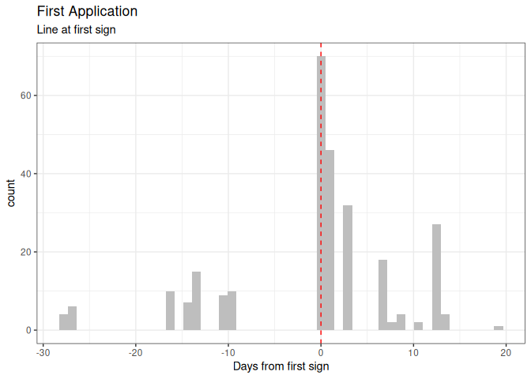
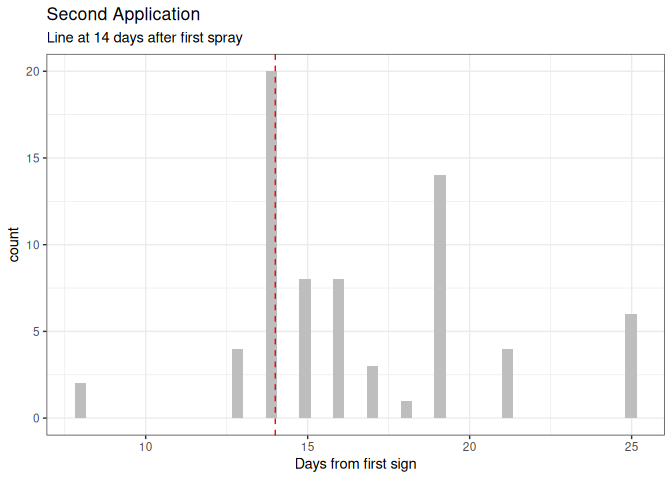
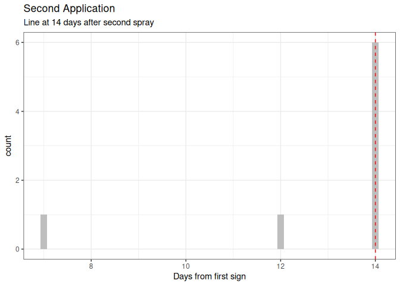
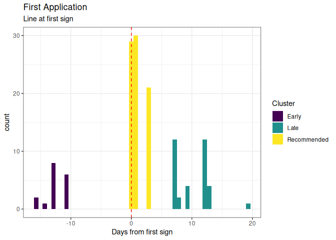
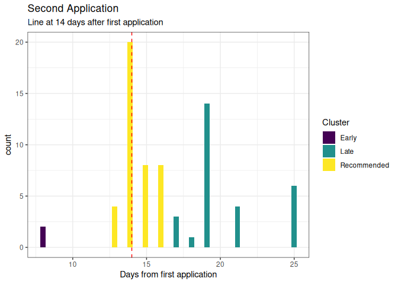
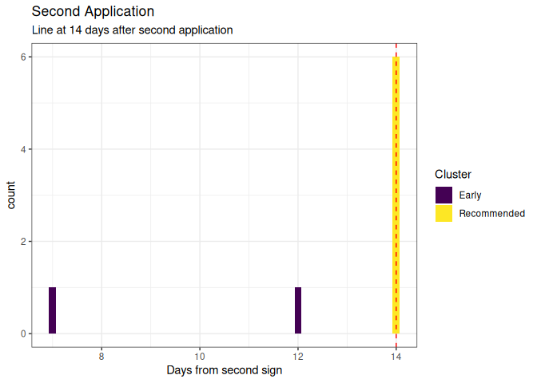

Mungbean Powdery Mildew Spray Timing
================
Adam H. Sparks
30/10/2019

# Clean data

The csv file included is already reduced in columns compared with the
original file. This next step converts the date columns to `Date` class,
removes more cols, including the dates for spray applications after two
(there are up to seven in some studies) and creates two columns of time
differences.

The first column of time differences is for the time from first sign to
first spray. The second is for time from first sign to second spray.

Any rows that are missing yield data are removed.

``` r
mb <-
  mb %>%
  mutate(fungicide_timing_1 = fungicide_application_1 - first_sign_disease) %>%
  mutate(fungicide_timing_2 = fungicide_application_2 - fungicide_application_1) %>%
  mutate(fungicide_timing_3 = fungicide_application_3 - fungicide_application_2) %>%
  filter(!is.na(grain_yield.t.ha)) %>% 
  filter(!is.na(PM_final_severity))
```

# Inspect the new data set

``` r
skim(mb)
```

    ## Skim summary statistics
    ##  n obs: 181 
    ##  n variables: 18 
    ## 
    ## ── Variable type:character ─────────────────────────
    ##      variable missing complete   n min max empty n_unique
    ##  fungicide_ai       0      181 181   7  13     0        3
    ##      location       0      181 181   6  12     0       12
    ##         trial       0      181 181  29  45     0       34
    ##     trial_ref       0      181 181   6  11     0       22
    ## 
    ## ── Variable type:Date ──────────────────────────────
    ##                 variable missing complete   n        min        max
    ##       first_sign_disease       0      181 181 2001-03-16 2019-04-12
    ##  fungicide_application_1      49      132 181 2011-03-09 2019-04-15
    ##  fungicide_application_2     111       70 181 2011-03-30 2019-04-29
    ##  fungicide_application_3     173        8 181 2011-04-13 2016-04-19
    ##      median n_unique
    ##  2017-03-07       21
    ##  2017-03-08       25
    ##  2017-03-24       22
    ##  2013-04-13        7
    ## 
    ## ── Variable type:difftime ──────────────────────────
    ##            variable missing complete   n      min     max  median n_unique
    ##  fungicide_timing_1      49      132 181 -16 days 19 days  1 days       13
    ##  fungicide_timing_2     111       70 181   8 days 25 days 16 days       10
    ##  fungicide_timing_3     173        8 181   7 days 14 days 14 days        3
    ## 
    ## ── Variable type:numeric ───────────────────────────
    ##                 variable missing complete   n mean    sd     p0  p25  p50
    ##         grain_yield.t.ha       0      181 181 1.16  0.55 0.28   0.71 1.04
    ##        PM_final_severity       0      181 181 6.46  2.12 1      5    7.3 
    ##  PM_final_severity_error      21      160 181 0.76  2.46 0      0    0   
    ##              row_spacing       4      177 181 0.61  0.28 0.25   0.25 0.75
    ##          total_fungicide       0      181 181 1.17  0.87 0      0    1   
    ##                     year       0      181 181 7.8   2.2  1      6    9   
    ##              yield_error      16      165 181 1.63 11.33 0.0069 0.11 0.18
    ##   p75   p100     hist
    ##  1.58   2.53 ▃▇▅▂▃▃▂▁
    ##  8      9    ▁▂▂▂▁▃▇▂
    ##  0.58  17.9  ▇▁▁▁▁▁▁▁
    ##  0.75   1    ▇▁▅▁▁▇▁▅
    ##  2      3    ▆▁▇▁▁▇▁▁
    ##  9     11    ▁▁▁▃▁▂▇▂
    ##  0.29 103.22 ▇▁▁▁▁▁▁▁

# Create Histograms of time differences to spray

## First spray

``` r
ggplot(filter(mb, !is.na(fungicide_timing_1)),
       aes(x = as.numeric(fungicide_timing_1))) +
  geom_histogram(bins = 50, fill = "grey") +
  geom_vline(linetype = 2,
             xintercept = 0,
             colour = "red") +
  xlab("Days from first sign") +
  ggtitle("First Application",
          subtitle = "Line at first sign") +
  theme_bw()
```

<!-- -->

Suggest that any sprays prior to first sign are a group with another
group from Day 0 to Day 3 and third group being \>= Day 4.

## Second spray

``` r
ggplot(filter(mb, !is.na(fungicide_timing_2)),
       aes(x = as.numeric(fungicide_timing_2))) +
   geom_histogram(bins = 50, fill = "grey") +
   geom_vline(linetype = 2,
              xintercept = 14,
              colour = "red") +
   xlab("Days from first sign") +
   ggtitle("Second Application",
           subtitle = "Line at 14 days after first spray") +
   theme_bw()
```

<!-- -->

Again, suggest any sprays that are prior to 14 days after first sign be
first group, the second being 14 days to 17 days after first sign and
the third being \>= 18 days after first sign.

These groups would then have preventative (before), at first sign and
then 14 days after and late applications.

## Third spray

``` r
ggplot(filter(mb, !is.na(fungicide_timing_3)),
       aes(x = as.numeric(fungicide_timing_3))) +
   geom_histogram(bins = 50, fill = "grey") +
   geom_vline(linetype = 2,
              xintercept = 14,
              colour = "red") +
   xlab("Days from first sign") +
   ggtitle("Second Application",
           subtitle = "Line at 14 days after second spray") +
   theme_bw()
```

<!-- -->

``` r
mb <-
  mb %>%
  mutate(
    cluster_1 = case_when(
      fungicide_timing_1 < 0 ~ "Early",
      fungicide_timing_1 >= 0 &
        fungicide_timing_1 < 4 ~ "Recommended",
      TRUE ~ "Late"
    )
  ) %>%
  mutate(
    cluster_2 = case_when(
      fungicide_timing_2 < 13 ~ "Early",
      fungicide_timing_2 >= 13 &
        fungicide_timing_2 < 17 ~ "Recommended",
      TRUE ~ "Late"
    )
  ) %>% 
  mutate(
    cluster_3 = case_when(
      fungicide_timing_3 < 14 ~ "Early",
      TRUE ~ "Recommended"
    )
  )
```

# Histograms with Clusters

## First spray

``` r
ggplot(filter(mb, !is.na(fungicide_timing_1)),
       aes(x = as.numeric(fungicide_timing_1))) +
  geom_histogram(bins = 50, aes(fill = cluster_1)) +
  scale_fill_viridis_d("Cluster") +
   geom_vline(linetype = 2,
              xintercept = 0,
              colour = "red") +
   xlab("Days from first sign") +
   ggtitle("First Application",
           subtitle = "Line at first sign") +
   theme_bw()
```

<!-- -->

## Second spray

The APVMA permit allows for a second spray not sooner than 14 days after
the first.

``` r
ggplot(filter(mb, !is.na(fungicide_timing_2)),
       aes(x = as.numeric(fungicide_timing_2))) +
  geom_histogram(bins = 50, aes(fill = cluster_2)) +
  scale_fill_viridis_d("Cluster") +
  geom_vline(linetype = 2,
             xintercept = 14,
             colour = "red") +
  xlab("Days from first application") +
  ggtitle("Second Application",
          subtitle = "Line at 14 days after first application") +
  theme_bw()
```

<!-- -->

Note that the cluster for the second spray “recommended” is from Day 13,
not Day 14.

## Third spray

The APVMA permit allows for a second spray not sooner than 14 days after
the first.

``` r
ggplot(filter(mb, !is.na(fungicide_timing_3)),
       aes(x = as.numeric(fungicide_timing_3))) +
  geom_histogram(bins = 50, aes(fill = cluster_3)) +
  scale_fill_viridis_d("Cluster") +
  geom_vline(linetype = 2,
             xintercept = 14,
             colour = "red") +
  xlab("Days from second sign") +
  ggtitle("Second Application",
          subtitle = "Line at 14 days after second application") +
  theme_bw()
```

<!-- -->
